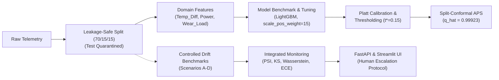

# Machine Failure Prediction with Drift Monitoring

An end-to-end machine-learning project for predictive maintenance, combining machine-failure prediction with probability calibration, uncertainty estimation, controlled distribution-shift analysis, and drift monitoring.

---

## 1. Overview

Industrial predictive maintenance models operate in non-stationary plant environments where mechanical wear, sensor decalibration, and thermal swings alter data distributions over time. While classifiers often achieve high benchmark scores offline, uncalibrated probabilities distort risk calculations, and undetected distribution drift can trigger unscheduled downtime or costly false alarms.

This project investigates model reliability under deployment-style distribution shifts rather than stopping at static binary classification:

$$\text{Predictive Modeling} \longrightarrow \text{Reliability} \longrightarrow \text{Uncertainty} \longrightarrow \text{Distribution Shift} \longrightarrow \text{Performance Analysis} \longrightarrow \text{Monitoring / Application}$$

The pipeline establishes a leakage-safe protocol, benchmarks multiple model families, calibrates probabilities, quantifies finite-sample uncertainty via conformal prediction, evaluates resilience across controlled sensor perturbations, and exposes an integrated monitoring service through FastAPI and Streamlit.

---

## Key Results

The project's verified findings across the validation and experimental benchmarks include:

- **Model Discrimination**: LightGBM achieved the strongest validation PR-AUC among the evaluated candidates at approximately **0.8997** (evaluated on the 1,500-sample validation split containing 51 failure cases; Random Forest reached 0.8742, XGBoost reached 0.8699, and Logistic Regression reached 0.3561).
- **Probability Calibration**: Platt scaling (sigmoid calibration) reduced validation 10-bin Expected Calibration Error (ECE) from **0.01932** (uncalibrated) to approximately **0.00590** (a 69.5% improvement) and validation Brier score from **0.01237** to **0.00740** (a 40.2% error reduction).
- **Cost-Sensitive Decision Threshold**: Operating at a cost-optimal threshold of $t^* = 0.15$ increased validation recall from **82.35%** (at default $t=0.50$) to **92.16%** under the explicitly stated hypothetical maintenance-cost assumptions ($C_{FN} = \$500$, $C_{FP} = \$30$).
- **Distribution Shift Dynamics**: Controlled drift benchmarks demonstrated that drift magnitude did not map proportionally onto downstream performance degradation; large univariate feature shifts did not directly predict the severity of downstream ranking or calibration deterioration.
- **Monitoring Architecture**: The integrated surveillance engine combines multivariate input drift, prediction score drift, calibration monitoring, and conformal uncertainty into four deterministic operational states: `NORMAL`, `WARNING`, `DRIFT_ALERT`, and `HUMAN_INSPECTION`.
- **Engineering Quality**: The automated test suite passes **40 / 40 tests** covering schema validation, feature engineering, calibration, conformal set guarantees, statistical drift properties, API contracts, and strict test-set quarantine.

---

## Applications

The methodologies implemented in this repository address practical industrial operational challenges:

- **Predictive Maintenance**: Early detection of mechanical degradation and impending failure in industrial milling machines.
- **Machine Health Monitoring**: Real-time surveillance of streaming telemetry against established in-control operational baselines.
- **Sensor Drift Surveillance**: Detection of decalibration, thermal offset, and sensor degradation across multi-channel telemetry before catastrophic failure occurs.
- **Failure-Risk Prioritization**: Calibrated probability estimation enabling maintenance teams to rank equipment by true operational risk rather than uncalibrated heuristic scores.
- **Maintenance Inspection Triage**: Cost-sensitive decision rules balancing the trade-off between unaddressed downtime and routine inspection overhead.
- **Human-in-the-Loop Decision Support**: Conformal uncertainty and drift guardrails that route ambiguous risk profiles to engineering technicians for physical inspection rather than relying on unguided autonomous execution.

---

## 2. Dataset & Target Leakage Prevention

The project uses the **AI4I 2020 Predictive Maintenance Dataset** (Matzka, 2020), a synthetic benchmark reflecting industrial milling machine operations:
- **Target**: `Machine failure` ($y \in \{0, 1\}$), with **339 failures across 10,000 observations (3.39%)**, an imbalance ratio of approximately $28.5 : 1$.
- **Features**: Product variant (`Type`: L, M, H) and 5 continuous sensors: air temperature, process temperature, rotational speed, torque, and tool wear.
- **Leakage Prevention**: Five failure-mode flags (`TWF`, `HDF`, `PWF`, `OSF`, `RNF`) represent post-hoc diagnoses recorded *after* breakdown. Retaining them introduces severe target leakage; all failure flags and identifier columns (`UDI`, `Product ID`) are quarantined and excluded.
- **Context & Synthetic Generation**: The data is synthetically generated from physical equations and rule-based failure mechanics (Matzka, 2020) rather than physical factory telemetry; results reflect controlled algorithmic benchmarks.

---

## 3. Workflow



---

## Example Decision Flow

The runtime decision flow maps raw sensor observations through probabilistic modeling, uncertainty quantification, and operational surveillance to generate actionable verdicts:

```
Sensor Telemetry
      ↓
LightGBM Prediction
      ↓
Calibrated Failure Probability (Platt scaling via 5-fold CV)
      ↓
Operational Threshold (t* = 0.15 under cost assumptions)
      ↓
Conformal Prediction Set (Split-conformal APS, q_hat = 0.99923)
      ↓
Drift Monitoring (Input PSI/KS + Prediction W_1/KS)
      ↓
System Verdict (NORMAL | WARNING | DRIFT_ALERT | HUMAN_INSPECTION)
```

### Operational Pipeline Implementation:
1. **Calibrated Failure Probability**: Raw classifier logits from LightGBM are mapped to well-calibrated posterior probabilities $\hat{p}_1 \in [0, 1]$ via Platt scaling, undoing the probability inflation caused by class-reweighting (`scale_pos_weight=15.0`).
2. **Operational Threshold ($t^* = 0.15$)**: The cost-sensitive decision layer applies $t^* = 0.15$ to emit an operational action (`Inspect` if $\hat{p}_1 \ge 0.15$, else `Normal`), minimizing expected cost under asymmetric failure consequences.
3. **Conformal Prediction Set**: Independent of the threshold decision, the split-conformal Adaptive Prediction Sets (APS) layer uses a frozen quantile ($\hat{q}_{0.10} = 0.99923$) to construct a set of plausible labels ($\{0\}$, $\{1\}$, or $\{0, 1\}$) with guaranteed finite-sample marginal coverage under exchangeability.
4. **Input Drift Surveillance**: Batch telemetry is evaluated against the reference baseline across continuous features using two-sample Kolmogorov-Smirnov (KS) tests and 10-bin reference-anchored Population Stability Index (PSI).
5. **Prediction Drift Surveillance**: Emitted risk scores are evaluated against reference predictions using KS tests and 1-Wasserstein distance ($W_1$).
6. **Supervised Reliability Tracking**: When ground-truth labels become available post-inspection, the pipeline tracks discrimination (PR-AUC, precision, recall) and probability reliability (Brier score, 10-bin ECE).
7. **System Verdict & Human Escalation**: A deterministic outcome engine combines all signals into a single status (`NORMAL`, `WARNING`, `DRIFT_ALERT`, or `HUMAN_INSPECTION`). Cases with elevated ambiguity or severe calibration loss route directly to engineering technicians for root-cause diagnosis, avoiding automated retraining.

---

## 4. Machine Learning Methodology

### Data Partitioning & Test Set Quarantine
Data is partitioned into a stratified **70% / 15% / 15% train/validation/test split** (`random_seed = 42`): 7,000 training, 1,500 validation, and 1,500 test samples. The data loader (`src.features.load_and_split_data`) programmatically quarantines the held-out test set (`return_test=False`), ensuring it remains completely untouched across all model selection, calibration, thresholding, and drift experiments. This strict quarantine prevents adaptive tuning contamination; evaluation on this final held-out partition remains reserved for prospective deployment validation.

### Domain Feature Engineering
Based on thermodynamics and cutting mechanics, three domain features were engineered:
1. **`Temp_Diff`**: $T_{\text{process}} - T_{\text{air}}$ captures dissipation failure conditions and reduces temperature collinearity from $r = +0.88$ to $-0.16$.
2. **`Power`**: $\tau \cdot \omega \cdot \frac{2\pi}{60}$ computes mechanical power from torque $\tau$ and rotational speed $\omega$.
3. **`Wear_Load`**: $\text{Tool wear} \times \tau$ captures cumulative tool fatigue under cutting load.

Continuous features are standardized with `StandardScaler` fit exclusively on training data. In 5-fold cross-validation ablation, removing `Temp_Diff` degraded validation PR-AUC by **$-0.1037$**, while removing all three domain features triggered a **$-0.2155$ drop** in PR-AUC.

### Model Benchmarking & Optimization
Under $28.5 : 1$ imbalance, **Precision-Recall AUC (PR-AUC)** served as primary evaluation metric. Validation benchmarking on engineered features yielded:
- **LightGBM**: PR-AUC = **0.8997**, ROC-AUC = 0.9807, F1 = 0.8350, Recall = 84.31%
- **Random Forest**: PR-AUC = 0.8742, ROC-AUC = 0.9819, F1 = 0.8454, Recall = 80.39%
- **XGBoost**: PR-AUC = 0.8699, ROC-AUC = 0.9856, F1 = 0.8155, Recall = 82.35%
- **Logistic Regression**: PR-AUC = 0.3561, ROC-AUC = 0.9048, F1 = 0.2787, Recall = 78.43%

LightGBM achieved the strongest observed validation PR-AUC among the evaluated candidates. Because the validation partition contains only 51 positive failure cases (out of 1,500 samples), the narrow margin among top tree ensembles should be interpreted with appropriate caution rather than claiming proven statistical superiority. LightGBM was selected as candidate model and tuned with `scale_pos_weight=15.0`, `num_leaves=15`, and `learning_rate=0.05` via 5-fold CV on `X_train`.

---

## 5. Model Reliability & Decision Making

### Probability Calibration
Tree models trained with class reweighting shift probabilities toward 1.0, distorting their reliability. Probability calibration was fitted using 5-fold stratified cross-validation within the training partition (`CalibratedClassifierCV(cv=5)`) and evaluated on the 1,500-sample validation split.

On validation data, Platt (sigmoid) scaling reduced Brier score from 0.01237 to **0.00740** (**40.2% error reduction**) and 10-bin Expected Calibration Error (ECE) from **0.01932** (uncalibrated) to **0.00590** (**69.5% improvement**). Non-parametric isotonic regression achieved slightly lower validation Brier score (0.00734) and 10-bin ECE (0.00443); however, Platt scaling was chosen for the operational pipeline because it produces a smooth, strictly monotonic probability mapping without the piecewise step-function plateaus that isotonic regression tends to form when positive counts are limited (51 validation failures).

*Methodological Caveat*: While 5-fold cross-fitting on training data prevents in-sample training leakage, calibration metrics evaluated on the validation set serve for model selection and may reflect validation-sample optimism relative to truly unseen test telemetry.

### Cost-Sensitive Operational Threshold
Default $t = 0.50$ assumes equal error costs. In predictive maintenance, missing a breakdown ($FN$) causes severe downtime, whereas false alarms ($FP$) cost a routine inspection. Under **explicitly hypothetical** costs ($C_{FN} = \$500$, $C_{FP} = \$30$), sweeping thresholds on validation data showed:
- **Default ($t = 0.50$)**: $FN = 9$, $FP = 4$, Recall = 82.35%, Total Cost = $\$4,620$
- **Cost-Optimal ($t^* = 0.15$)**: $FN = 4$, $FP = 20$, Recall = **92.16%**, Total Cost = **$\$2,600$**

Lowering the threshold to $t^* = 0.15$ achieved a **43.7% cost reduction** on the validation partition under these stated hypothetical cost assumptions. This threshold is an empirical, project-specific operational decision rule for triage, not a universal optimal threshold, and does not alter the underlying model's ranking ability.

---

## 6. Uncertainty with Conformal Prediction

To complement point probabilities with finite-sample statistical guarantees, the pipeline implements **Split-Conformal Adaptive Prediction Sets (APS)** (Romano et al., 2020). Using an independent calibration split ($N = 750$) from the validation partition at significance level $\alpha = 0.10$ (90% nominal target coverage) yielded an empirical nonconformity quantile of **$\hat{q}_{0.10} = 0.99923$**.

On the evaluation split ($N = 750$), the conformal layer yielded:
- **Empirical Marginal Coverage**: **100.00%** (satisfying the $\ge 90\%$ finite-sample marginal coverage guarantee under exchangeability).
- **Average Prediction-Set Size**: **1.924**.
- **Singleton Set Rate**: **7.60%** (57 instances formed confident singleton $\{0\}$ sets; singleton $\{1\}$ rate was 0.00% as failure probabilities did not exceed $\hat{q}_{0.10}$).
- **Ambiguous Set Rate**: **92.40%** (693 instances required both classes $\{0, 1\}$ to cover the required cumulative probability mass).
- **Empty-Set Rate**: **0.00%** (APS by design includes at least the top-ranked class).

### High Ambiguity under Class Imbalance
Because the dataset is heavily imbalanced (3.4% failure base rate, with healthy machines dominating the cumulative probability distribution), the $(1-\alpha)$ quantile of cumulative mass required to encompass the true label is very high ($\hat{q}_{0.10} = 0.99923$). Consequently, only instances in the extreme upper tail of confidence ($P(\text{No Failure}) \ge 0.99923$) qualify as singleton sets; all other instances require both classes to satisfy the marginal guarantee. 

While marginal validity holds under data exchangeability, this high ambiguity rate limits the utility of standard APS as a fine-grained triage filter in this specific configuration. Investigating class-conditional (Mondrian) conformal prediction or alternative nonconformity score formulations designed for extreme imbalance represents a natural avenue for future work.

---

## 7. Controlled Drift Simulation & Monitoring

Four controlled synthetic shift benchmarks were generated from the 1,500-sample validation split: Scenario A (+3K temperature), Scenario B (+10Nm torque), Scenario C (2.5x variance expansion), and Scenario D (combined multi-sensor shift). *These are controlled synthetic perturbations, not observed physical plant logs.*

### Distinguishing Drift Phenomena
The framework explicitly separates three operational concepts:
- **Input Drift ($P(X)$)**: Shift in feature space, tracked via Kolmogorov-Smirnov (KS) tests and 10-bin reference-anchored Population Stability Index (PSI).
- **Prediction Drift ($P(\hat{Y})$)**: Shift in emitted risk scores, tracked via KS tests and 1-Wasserstein distance ($W_1$).
- **Performance Degradation ($P(Y \mid X)$)**: Deterioration in discrimination and calibration when ground-truth labels are available (PR-AUC, precision, recall, Brier, ECE).

### Drift Magnitude Did Not Map Proportionally Onto Performance Loss
A key empirical finding across the controlled experiments is that **drift magnitude did not map proportionally onto performance loss**:
- In **Scenario A (Thermal Shift)**, a uniform $+3\text{ K}$ shift induced severe univariate input drift on raw temperatures ($\text{PSI} = 2.7093$, `ALERT`). However, the physical temperature differential feature ($\Delta T$) remained stable, resulting in modest prediction score shift ($W_1 = 0.01459$) and relatively preserved recall at $t^* = 0.15$ ($90.20\%$ vs $92.16\%$). Nonetheless, measurable performance degradation occurred: PR-AUC dropped from **0.9163** to **0.6864**, precision dropped from **70.15%** to **48.94%**, Brier score increased from **0.00740** to **0.01707**, and ECE rose from **0.00590** to **0.01690**.
- In **Scenario B (Torque Shift)**, the $+10\text{ Nm}$ torque shift propagated through the mechanical equations into `Power` and `Wear_Load`, inducing significant prediction drift ($W_1 = 0.09523$). While recall held ($88.24\%$), false positives surged, collapsing precision from **70.15%** to **17.24%** and driving ECE up to **0.09578**.
- In **Scenario C (Variance Expansion)**, a 2.5× variance increase scattered telemetry into extreme distribution tails, triggering catastrophic probability breakdown ($\text{ECE} = 0.13118 > 0.10$) and collapsing precision to **14.20%**, despite a lower input PSI ($0.8122$) than in Scenarios A and B.
- In **Scenario D (Combined Multi-Sensor Shift)**, compound shifts degraded ranking across the entire spectrum, yielding the lowest PR-AUC (**0.4102**).

These scenarios demonstrate that the magnitude of a univariate input drift statistic does not directly predict downstream performance loss. Different drift patterns affect the model differently, and input drift, prediction drift, and downstream performance degradation should therefore be monitored as related but distinct operational signals. Statistical drift metrics describe distributional divergence but do not establish physical causality.

### Operational Thresholds and Baseline Context
The reference baseline metrics are computed directly against the reference distribution itself; near-zero baseline drift ($\text{PSI} = 0.0000, W_1 = 0.0000$) is therefore expected by construction. An empirical evaluation of false-alarm rates on an independent, clean held-out test distribution has not yet been conducted and represents future validation work. Furthermore, the monitoring trigger thresholds ($\text{PSI} > 0.25$, $W_1 \ge 0.05$, $\text{ECE} > 0.10$, ambiguity $\ge 95\%$) are project-specific operational heuristics informed by the controlled benchmarks, rather than universal statistical standards.

---

## 8. Integrated Monitoring & Application Architecture

The monitoring engine (`src/app.py`) aggregates input drift, prediction drift, conformal ambiguity, and optional calibration metrics into a single deterministic verdict:
- **`HUMAN_INSPECTION`**: Safety override (Supervised ECE $> 0.10$ OR Conformal Ambiguity Rate $\ge 95.0\%$).
- **`DRIFT_ALERT`**: Input Max Feature PSI $> 0.25$ OR Prediction Wasserstein $W_1 \ge 0.05$.
- **`WARNING`**: Max Feature PSI in $[0.10, 0.25]$ OR Prediction $W_1$ in $[0.02, 0.05)$.
- **`NORMAL`**: All metrics within in-control baseline limits.

### Human-in-the-Loop Governance
The system **strictly avoids autonomous retraining**. Automatically updating weights on unverified drift risks learning transient sensor defects or creating unstable feedback loops. Drift alerts route to maintenance engineers for physical root-cause diagnosis.

### Service Architecture
- **FastAPI Backend (`src/api.py`)**: Exposes `/health`, `/predict` (calibrated probability, $t^*$ decision, conformal set), and `/monitor` (batch surveillance).
- **Streamlit UI (`streamlit_app.py`)**: Interactive interface with single-sample inference and batch surveillance tabs.
- **Client Adapter (`src/client.py`)**: Supports live HTTP or an in-process `TestClient` for zero-setup execution.

<!-- [Screenshot: Streamlit Operational Monitoring Dashboard] -->
> **User Interface**: The Streamlit dashboard (`streamlit_app.py`) provides single-sample inference (emitting probability, decision, and conformal sets) and batch surveillance tabs (visualizing feature PSI tables, prediction score distributions, and deterministic health verdicts). Run `streamlit run streamlit_app.py` to view the interactive interface locally.

---

## Sample Prediction

The FastAPI service exposes real-time inference via the `/predict` endpoint:

### Illustrative API Request
```bash
curl -X POST "http://127.0.0.1:8000/predict" \
     -H "Content-Type: application/json" \
     -d '{
       "Type": "M",
       "Air temperature [K]": 298.1,
       "Process temperature [K]": 308.6,
       "Rotational speed [rpm]": 1551.0,
       "Torque [Nm]": 42.8,
       "Tool wear [min]": 0.0
     }'
```

### Verified API Response
```json
{
  "failure_probability": 0.00063,
  "prediction": 0,
  "threshold_used": 0.15,
  "prediction_set": [
    "No Failure"
  ],
  "is_ambiguous": false
}
```

### Response Field Descriptions:
- `failure_probability`: **0.00063** — Platt-calibrated failure probability (reflecting true physical risk rather than reweighted raw scores).
- `prediction`: **0** — Binary operational classification (`0 = Normal`, `1 = Inspect`), evaluated against $t^* = 0.15$.
- `threshold_used`: **0.15** — Operating decision threshold derived from the cost-sensitive optimization.
- `prediction_set`: `["No Failure"]` — Conformal prediction set constructed using the frozen quantile $\hat{q}_{0.10} = 0.99923$ at $\alpha = 0.10$ (90% target coverage).
- `is_ambiguous`: `false` — Boolean indicator; single-class prediction sets proceed without technician triage, whereas sets containing both classes (`is_ambiguous = true`) flag human inspection.

---

## 9. Experiment Tracking & Testing

- **MLflow**: Local tracking of hyperparameter sweeps, calibration curves, and model artifacts (`mlruns/mlflow.db`).
- **Test Suite**: Automated `pytest` suite with **40 / 40 passing tests** covering feature engineering, schema bounds, calibration, conformal sets, statistical drift properties, monitoring logic, and test quarantine guarantees.

---

## 10. Representative Experimental Results

The following verified results compare the reference validation baseline against the four controlled synthetic drift scenarios (evaluated on the 1,500-sample validation split using the Platt-calibrated Champion LightGBM at $t^* = 0.15$ and $\hat{q}_{0.10} = 0.99923$):

| Batch / Scenario | Max Feature PSI | Pred Wasserstein ($W_1$) | PR-AUC | Recall ($t^*=0.15$) | Precision ($t^*=0.15$) | 10-Bin ECE | Conformal Ambiguity | Consolidated Outcome |
| :--- | :---: | :---: | :---: | :---: | :---: | :---: | :---: | :---: |
| **Reference Baseline** | 0.0000 | 0.00000 | **0.9163** | 92.16% | 70.15% | **0.00590** | 91.73% | `NORMAL` |
| **Scenario A (Thermal)** | 2.7093 | 0.01459 | 0.6864 | 90.20% | 48.94% | 0.01690 | 97.07% | `HUMAN_INSPECTION` |
| **Scenario B (Torque)** | 3.3161 | 0.09523 | 0.5329 | 88.24% | 17.24% | 0.09578 | 88.00% | `DRIFT_ALERT` |
| **Scenario C (Variance)** | 0.8122 | 0.07849 | 0.4898 | 96.08% | 14.20% | 0.13118 | 91.20% | `HUMAN_INSPECTION` |
| **Scenario D (Combined)** | 1.8385 | 0.05260 | 0.4102 | 86.27% | 22.80% | 0.07285 | 96.27% | `HUMAN_INSPECTION` |

*Note: In Scenario A, conformal ambiguity rose to $97.07\% \ge 95\%$, triggering human inspection. In Scenario C, probability breakdown ($\text{ECE} = 0.13118 > 0.10$) triggered the reliability safety override.*
*Visual diagnostics (pre- and post-calibration reliability diagrams, Precision-Recall curves, and scenario score distributions) are generated in analysis notebooks `06_probability_calibration.ipynb`, `08_conformal_prediction.ipynb`, and `13_drift_performance_analysis.ipynb`, and logged to MLflow.*

---

## 11. Repository Structure

```
predictive-maintenance-ml-monitoring/
├── configs/          # Central configuration (random seed, data paths, target column)
├── data/             # Raw AI4I dataset and 4 processed synthetic drift benchmarks
├── notebooks/        # 14 sequential experimental notebooks (EDA to Monitoring)
├── src/              # Python package (features, models, drift, app, api, client)
├── tests/            # Automated pytest suite (40 passing tests)
├── requirements.txt  # Pinned Python package dependencies
├── streamlit_app.py  # Interactive Streamlit telemetry and surveillance dashboard
└── README.md         # Project technical documentation
```

---

## 12. Reproducibility & Setup

```bash
# Environment setup (Python 3.13)
git clone https://github.com/manishzx17/predictive-maintenance-ml-monitoring.git
cd predictive-maintenance-ml-monitoring
python -m venv .venv
source .venv/bin/activate       # On Windows: .venv\Scripts\activate
pip install -r requirements.txt

# Run automated tests
pytest -v

# Launch Streamlit application (standalone in-process mode)
streamlit run streamlit_app.py

# Optional: Launch full two-tier architecture
# Terminal 1: uvicorn src.api:app --reload --host 127.0.0.1 --port 8000
# Terminal 2: streamlit run streamlit_app.py
```

---

## 13. Limitations & Future Work

### Limitations
1. **Synthetic Telemetry & Engineered Alignment**: The AI4I 2020 dataset is synthetic and its failure labels are generated from documented rule-based failure mechanisms. Some engineered features used in this project, such as power and wear-load relationships, therefore align closely with the underlying data-generation mechanisms. The resulting feature importance and ablation gains should not be assumed to transfer directly to real industrial machinery without validation on real telemetry.
2. **Controlled Perturbations**: Distribution shifts were synthetically injected into validation data rather than recorded from physical machine degradation logs.
3. **Hypothetical Costs**: Maintenance costs ($C_{FN}=\$500, C_{FP}=\$30$) are illustrative hypothetical assumptions; industrial deployment requires empirical cost audits.
4. **Exchangeability Assumption**: Conformal prediction marginal coverage guarantees assume data exchangeability, which is challenged under distribution shift.
5. **Conformal Ambiguity Under Imbalance**: Standard APS produces high ambiguity rates (~92%) under extreme class imbalance, limiting its effectiveness as a direct triage mechanism without class-conditional adaptation.
6. **No Causal Attribution**: Statistical drift metrics track distributional divergence but do not identify physical root causes.
7. **No Autonomous Retraining**: Retraining is intentionally not automated, requiring human engineering triage.
8. **Held-Out Test Set Quarantine**: The 1,500-sample test set has been strictly quarantined throughout all modeling, calibration, and drift benchmarks. Evaluation on this untouched partition remains to be reported upon formal deployment testing to assess prospective generalization without adaptive tuning bias.
9. **Unevaluated Clean False-Alarm Rate**: Reference baseline drift metrics are near zero by construction; formal false-alarm rates on an independent clean held-out test distribution remain to be quantified.

### Future Work
- **Real Industrial Telemetry**: Evaluating calibration and drift monitoring on real-world industrial vibration and acoustic datasets.
- **Class-Conditional Conformal Prediction**: Implementing Mondrian conformal prediction to achieve class-balanced coverage and reduce doubleton ambiguity under extreme imbalance.
- **Clean Held-Out False-Alarm Benchmarking**: Quantifying empirical false-alarm rates of the monitoring engine across independent clean test splits.
- **Temporal Drift Monitoring**: Adding rolling-window change-point detection (e.g., CUSUM, Page-Hinkley) for continuous gradual drift surveillance.
- **Cost-Sensitive Conformal Prediction**: Incorporating asymmetric misclassification penalties directly into nonconformity score functions.
- **Drift Attribution**: Using Shapley-value drift decomposition to isolate which specific sensor changes drove performance degradation.

, A., Davidson, A., Ghodsi, A., Hong, S. A., Konwinski, A., Murching, S., Nykodym, T., Ogilvie, P., Parkhe, M., Xie, F., & Zumar, C. (2018). Accelerating the Machine Learning Lifecycle with MLflow. *IEEE Data Engineering Bulletin*, 41(4), pp. 39–45.
