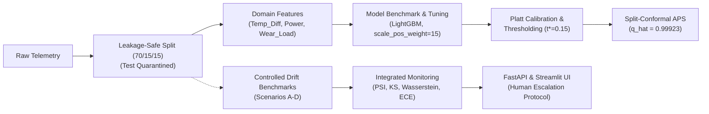

# Machine Failure Prediction with Drift Monitoring

An end-to-end machine-learning project for predictive maintenance, combining machine-failure prediction with probability calibration, uncertainty estimation, controlled distribution-shift analysis, and drift monitoring.

---

## 1. Overview

Industrial predictive maintenance models operate in non-stationary plant environments where mechanical wear, sensor decalibration, and thermal swings alter data distributions over time. While classifiers often achieve high benchmark scores offline, uncalibrated probabilities distort risk calculations, and undetected distribution drift can trigger unscheduled downtime or costly false alarms.

This project investigates model reliability under deployment-style distribution shifts rather than stopping at static binary classification:

$$\text{Predictive Modeling} \longrightarrow \text{Reliability} \longrightarrow \text{Uncertainty} \longrightarrow \text{Distribution Shift} \longrightarrow \text{Performance Analysis} \longrightarrow \text{Monitoring / Application}$$

The pipeline establishes a leakage-safe protocol, benchmarks multiple model families, calibrates probabilities, quantifies finite-sample uncertainty via conformal prediction, evaluates resilience across controlled sensor perturbations, and exposes an integrated monitoring service through FastAPI and Streamlit.

---

## 2. Dataset & Target Leakage Prevention

The project uses the **AI4I 2020 Predictive Maintenance Dataset** (Matzka, 2020), a synthetic benchmark reflecting industrial milling machine operations:
- **Target**: `Machine failure` ($y \in \{0, 1\}$), with **339 failures across 10,000 observations (3.39%)**, an imbalance ratio of approximately $28.5 : 1$.
- **Features**: Product variant (`Type`: L, M, H) and 5 continuous sensors: air temperature, process temperature, rotational speed, torque, and tool wear.
- **Leakage Prevention**: Five failure-mode flags (`TWF`, `HDF`, `PWF`, `OSF`, `RNF`) represent post-hoc diagnoses recorded *after* breakdown. Retaining them introduces severe target leakage; all failure flags and identifier columns (`UDI`, `Product ID`) are quarantined and excluded.
- **Context**: The data is synthetic/simulated rather than physical factory telemetry; results reflect controlled algorithmic benchmarks.

---

## 3. Workflow



---

## 4. Machine Learning Methodology

### Data Partitioning & Test Set Quarantine
Data is partitioned into a stratified **70% / 15% / 15% train/validation/test split** (`random_seed = 42`): 7,000 training, 1,500 validation, and 1,500 test samples. The data loader (`src.features.load_and_split_data`) programmatically quarantines the held-out test set (`return_test=False`), ensuring it remains completely untouched across all model selection, calibration, thresholding, and drift experiments.

### Domain Feature Engineering
Based on thermodynamics and cutting mechanics, three domain features were engineered:
1. **`Temp_Diff`**: $T_{\text{process}} - T_{\text{air}}$ captures dissipation failure conditions and reduces temperature collinearity from $r = +0.88$ to $-0.16$.
2. **`Power`**: $\tau \cdot \omega \cdot \frac{2\pi}{60}$ computes mechanical power from torque $\tau$ and rotational speed $\omega$.
3. **`Wear_Load`**: $\text{Tool wear} \times \tau$ captures cumulative tool fatigue under cutting load.

Continuous features are standardized with `StandardScaler` fit exclusively on training data. In 5-fold cross-validation ablation, removing `Temp_Diff` degraded validation PR-AUC by **$-0.1037$**, while removing all three domain features triggered a **$-0.2155$ drop** in PR-AUC.

### Model Benchmarking & Optimization
Under $28.5 : 1$ imbalance, **Precision-Recall AUC (PR-AUC)** served as primary evaluation metric. Validation benchmarking on engineered features yielded:
- **LightGBM**: PR-AUC = **0.8997**, ROC-AUC = 0.9807, F1 = 0.8350, Recall = 84.31%
- **Random Forest**: PR-AUC = 0.8742, ROC-AUC = 0.9819, F1 = 0.8454, Recall = 80.39%
- **XGBoost**: PR-AUC = 0.8699, ROC-AUC = 0.9856, F1 = 0.8155, Recall = 82.35%
- **Logistic Regression**: PR-AUC = 0.3561, ROC-AUC = 0.9048, F1 = 0.2787, Recall = 78.43%

LightGBM was selected as candidate model based on validation evidence, tuned with `scale_pos_weight=15.0`, `num_leaves=15`, and `learning_rate=0.05` via 5-fold CV on `X_train`.

---

## 5. Model Reliability & Decision Making

### Probability Calibration
Tree models trained with class reweighting shift probabilities toward 1.0, distorting their reliability. On validation data, Platt (sigmoid) scaling reduced Brier score from 0.01237 to **0.00740** (**40.2% error reduction**) and 10-bin Expected Calibration Error (ECE) from 0.04018 to **0.00590**. Platt scaling was chosen over isotonic regression (Brier 0.00734, ECE 0.00443) because it produces smooth, monotonic probabilities without step-function plateaus on limited positive counts.

### Cost-Sensitive Operational Threshold
Default $t = 0.50$ assumes equal error costs. In predictive maintenance, missing a breakdown ($FN$) causes severe downtime, whereas false alarms ($FP$) cost a routine inspection. Under **explicitly hypothetical** costs ($C_{FN} = \$500$, $C_{FP} = \$30$), sweeping thresholds on validation data showed:
- **Default ($t = 0.50$)**: $FN = 9$, $FP = 4$, Recall = 82.35%, Total Cost = $\$4,620$
- **Cost-Optimal ($t^* = 0.15$)**: $FN = 4$, $FP = 20$, Recall = **92.16%**, Total Cost = **$\$2,600$**

Lowering the threshold to $t^* = 0.15$ achieved a **43.7% cost reduction** under these hypothetical assumptions. This threshold is an empirical, project-specific choice rather than a universal standard.

---

## 6. Uncertainty with Conformal Prediction

To complement point probabilities with finite-sample statistical guarantees, the pipeline implements **Split-Conformal Adaptive Prediction Sets (APS)**. Calibrating at $\alpha = 0.10$ (90% target coverage) on an independent calibration split yielded an empirical nonconformity quantile of **$\hat{q}_{0.10} = 0.99923$**:
- **Singleton Sets ($\{0\}$ or $\{1\}$)**: High certainty; automated classification proceeds safely.
- **Ambiguous Sets ($\{0, 1\}$)**: The model cannot rule out either outcome at 90% confidence, routing the case to **human inspection triage**.

Conformal marginal coverage guarantees hold under data exchangeability; when distribution shift occurs, empirical coverage can deviate from nominal levels.

---

## 7. Controlled Drift Simulation & Monitoring

Four controlled synthetic shift benchmarks were generated from the 1,500-sample validation split: Scenario A (+3K temperature), Scenario B (+10Nm torque), Scenario C (2.5x variance expansion), and Scenario D (combined multi-sensor shift). *These are controlled synthetic perturbations, not observed physical plant logs.*

### Distinguishing Drift Phenomena
The framework explicitly separates three operational concepts:
- **Input Drift ($P(X)$)**: Shift in feature space, tracked via Kolmogorov-Smirnov (KS) tests and 10-bin reference-anchored Population Stability Index (PSI).
- **Prediction Drift ($P(\hat{Y})$)**: Shift in emitted risk scores, tracked via KS tests and 1-Wasserstein distance ($W_1$).
- **Performance Degradation ($P(Y \mid X)$)**: True deterioration in discrimination and calibration when ground-truth labels are available (PR-AUC, precision, recall, Brier, ECE).

### Statistical Drift Does Not Automatically Imply Degradation
A key empirical finding is that **statistical drift does not prove performance degradation, nor does it establish physical causality**:
- In **Scenario A**, despite severe input drift on raw temperatures ($\text{PSI} = 2.7093$, `ALERT`), the domain feature $\Delta T$ remained stable. Prediction drift was minimal ($W_1 = 0.01459$), and recall at $t^* = 0.15$ held steady ($90.20\%$).
- In **Scenario B**, torque shift propagated into `Power` and `Wear_Load`, causing significant prediction drift ($W_1 = 0.09523$). While recall held ($88.24\%$), false positives surged, collapsing precision from $70.15\%$ to $17.24\%$.
- In **Scenario C**, variance expansion degraded class separability, causing severe probability breakdown ($\text{ECE} = 0.13118 > 0.10$).

---

## 8. Integrated Monitoring & Application Architecture

The monitoring engine (`src/app.py`) aggregates input drift, prediction drift, conformal ambiguity, and optional calibration metrics into a single deterministic verdict:
- **`HUMAN_INSPECTION`**: Safety override (Supervised ECE $> 0.10$ OR Conformal Ambiguity Rate $\ge 95.0\%$).
- **`DRIFT_ALERT`**: Input Max Feature PSI $> 0.25$ OR Prediction Wasserstein $W_1 \ge 0.05$.
- **`WARNING`**: Max Feature PSI in $[0.10, 0.25]$ OR Prediction $W_1$ in $[0.02, 0.05)$.
- **`NORMAL`**: All metrics within in-control baseline limits.

### Human-in-the-Loop Governance
The system **strictly avoids autonomous retraining**. Automatically updating weights on unverified drift risks learning transient sensor defects or creating unstable feedback loops. Drift alerts route to maintenance engineers for physical root-cause diagnosis.

### Service Architecture
- **FastAPI Backend (`src/api.py`)**: Exposes `/health`, `/predict` (calibrated probability, $t^*$ decision, conformal set), and `/monitor` (batch surveillance).
- **Streamlit UI (`streamlit_app.py`)**: Interactive interface with single-sample inference and batch surveillance tabs.
- **Client Adapter (`src/client.py`)**: Supports live HTTP or an in-process `TestClient` for zero-setup execution.

---

## 9. Experiment Tracking & Testing

- **MLflow**: Local tracking of hyperparameter sweeps, calibration curves, and model artifacts (`mlruns/mlflow.db`).
- **Test Suite**: Automated `pytest` suite with **40 / 40 passing tests** covering feature engineering, schema bounds, calibration, conformal sets, statistical drift properties, monitoring logic, and test quarantine guarantees.

---

## 10. Representative Experimental Results

The following verified results compare the reference validation baseline against the four controlled synthetic drift scenarios (evaluated on the 1,500-sample validation split using the Platt-calibrated Champion LightGBM at $t^* = 0.15$ and $\hat{q}_{0.10} = 0.99923$):

| Batch / Scenario | Max Feature PSI | Pred Wasserstein ($W_1$) | PR-AUC | Recall ($t^*=0.15$) | Precision ($t^*=0.15$) | 10-Bin ECE | Conformal Ambiguity | Consolidated Outcome |
| :--- | :---: | :---: | :---: | :---: | :---: | :---: | :---: | :---: |
| **Reference Baseline** | 0.0000 | 0.00000 | **0.9163** | 92.16% | 70.15% | **0.00590** | 91.73% | `NORMAL` |
| **Scenario A (Thermal)** | 2.7093 | 0.01459 | 0.6864 | 90.20% | 48.94% | 0.01690 | 97.07% | `HUMAN_INSPECTION` |
| **Scenario B (Torque)** | 3.3161 | 0.09523 | 0.5329 | 88.24% | 17.24% | 0.09578 | 88.00% | `DRIFT_ALERT` |
| **Scenario C (Variance)** | 0.8122 | 0.07849 | 0.4898 | 96.08% | 14.20% | 0.13118 | 91.20% | `HUMAN_INSPECTION` |
| **Scenario D (Combined)** | 1.8385 | 0.05260 | 0.4102 | 86.27% | 22.80% | 0.07285 | 96.27% | `HUMAN_INSPECTION` |

*Note: In Scenario A, conformal ambiguity rose to $97.07\% \ge 95\%$, triggering human inspection. In Scenario C, probability breakdown ($\text{ECE} = 0.13118 > 0.10$) triggered the reliability safety override.*

---

## 11. Repository Structure

```
machine-failure-drift-monitor/
├── configs/          # Central configuration (random seed, data paths, target column)
├── data/             # Raw AI4I dataset and 4 processed synthetic drift benchmarks
├── notebooks/        # 14 sequential experimental notebooks (EDA to Monitoring)
├── src/              # Python package (features, models, drift, app, api, client)
├── tests/            # Automated pytest suite (40 passing tests)
├── requirements.txt  # Pinned Python package dependencies
├── streamlit_app.py  # Interactive Streamlit telemetry and surveillance dashboard
└── README.md         # Project technical documentation
```

---

## 12. Reproducibility & Setup

```bash
# Environment setup (Python 3.13)
git clone https://github.com/manishzx17/predictive-maintenance-ml-monitoring.git
cd machine-failure-drift-monitor
python -m venv .venv
source .venv/bin/activate       # On Windows: .venv\Scripts\activate
pip install -r requirements.txt

# Run automated tests
pytest -v

# Launch Streamlit application (standalone in-process mode)
streamlit run streamlit_app.py

# Optional: Launch full two-tier architecture
# Terminal 1: uvicorn src.api:app --reload --host 127.0.0.1 --port 8000
# Terminal 2: streamlit run streamlit_app.py
```

---

## 13. Limitations & Future Work

### Limitations
1. **Synthetic Telemetry**: AI4I 2020 is simulated, meaning physical interactions follow idealized rules rather than real machine dynamics.
2. **Controlled Perturbations**: Distribution shifts were synthetically injected rather than recorded from factory degradation.
3. **Hypothetical Costs**: Maintenance costs ($C_{FN}=\$500, C_{FP}=\$30$) are illustrative; production environments require empirical cost audits.
4. **Exchangeability Assumption**: Conformal prediction marginal coverage guarantees assume data exchangeability, which is challenged under distribution shift.
5. **No Causal Attribution**: Statistical drift metrics track distribution changes but do not identify physical root causes.
6. **No Autonomous Retraining**: Retraining is intentionally not automated, requiring human triage.

### Future Work
- **Real Industrial Telemetry**: Evaluating calibration and drift monitoring on real-world industrial vibration and acoustic datasets.
- **Temporal Drift Monitoring**: Adding rolling-window change-point detection (e.g., CUSUM, Page-Hinkley) for continuous gradual drift.
- **Cost-Sensitive Conformal Prediction**: Incorporating asymmetric misclassification penalties directly into nonconformity score functions.
- **Drift Attribution**: Using Shapley-value drift decomposition to isolate which specific sensor changes drove performance degradation.
